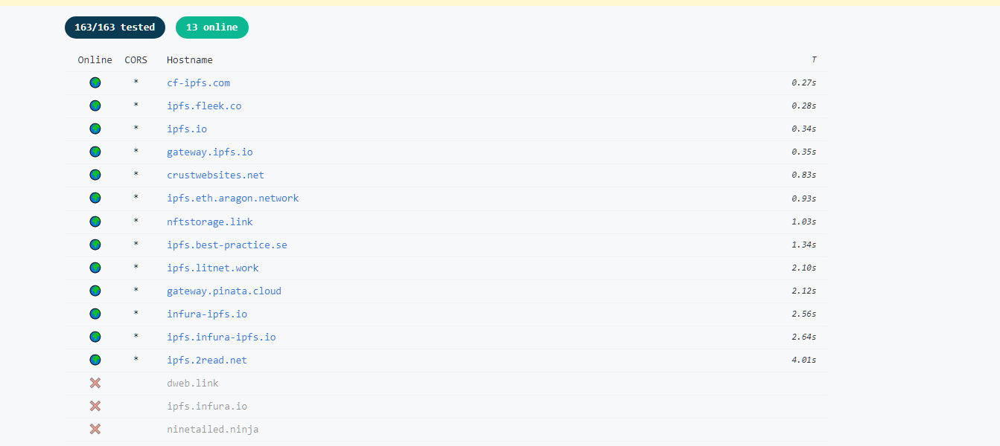
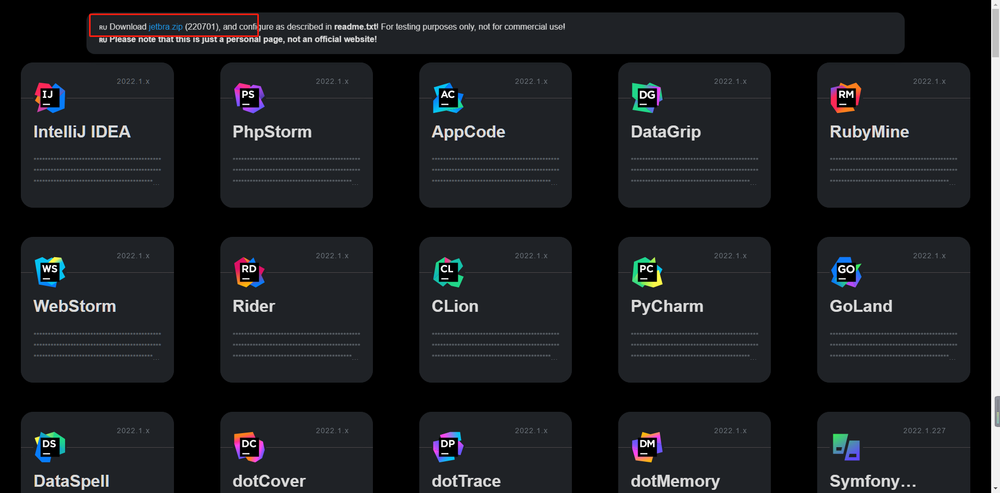
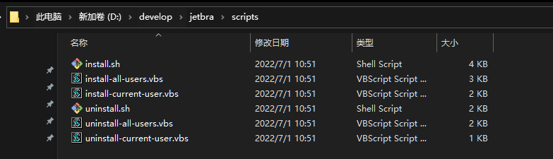
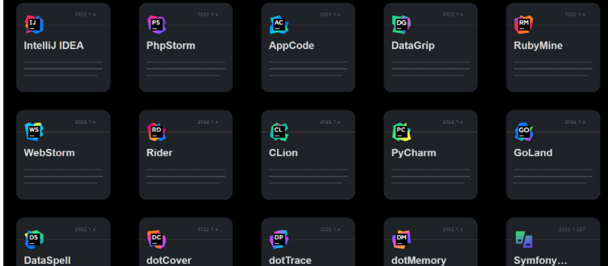
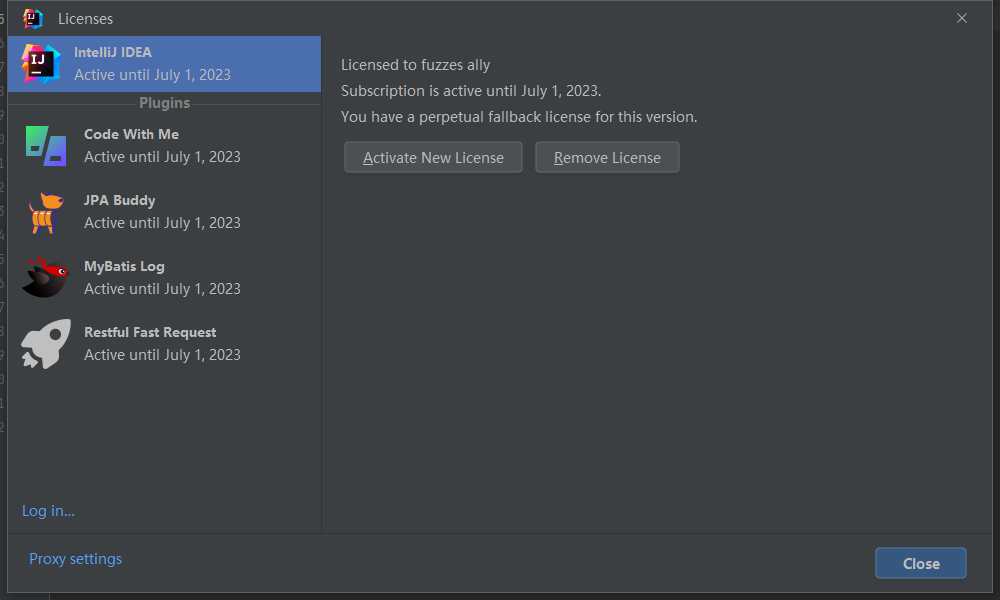

# IDEA 2022.1.3以及收费插件破解方法
* 官方下载2022.1.3
* 打开[JETBRA.IN CHECKER | IPFS](https://3.jetbra.in/)选择一个节点进入

* 下载红框中文件并解压
* 执行解压文件夹，执行scripts中的对应执行脚本

windows执行vbs，linux和mac执行sh(脚本修改了环境变量和IDEA配置，如果有杀毒软件允许执行即可)

第一次点开会提示确定后开始执行，出现done后执行完毕

* 打开IDEA 不要登录IDEA账户，填入激活码，可直接从网页上复制，对应需要激活什么插件就复制哪个粘贴进去

